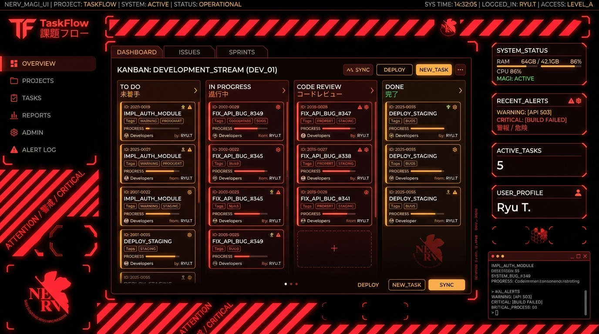
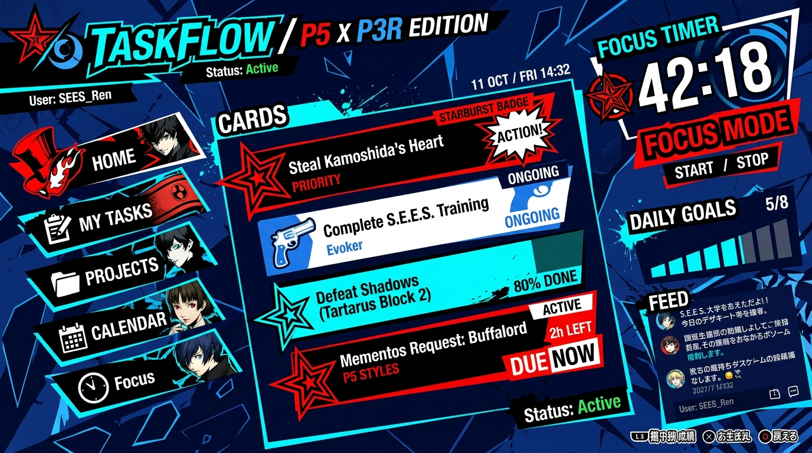

# TaskFlow

TaskFlow is an advanced, high-performance desktop productivity suite built with Electron, React 18, and Vite 5. Designed for technical professionals, power users, and developers who demand speed, focus, and visual elegance, TaskFlow pairs full-spectrum task management with a dual-theme anime visual engine and native Windows desktop floating widgets.

---

## Interface Showcase


*TaskFlow NERV MAGI Mode — Pitch-black canvas, hazard caution warning lines, MAGI supercomputer nodes, Japanese kanji stencil alerts, and dense tactical task matrix.*


*TaskFlow Persona 5 + 3 Reload Theme — Phantom Red and Electric Cyan skewed panels, ransomware cutout typography, starburst badges, and Focus Studio.*

---

## Technical Overview & Key Features

### Dual Visual Theme Engine
TaskFlow features a real-time switchable design system supporting two completely isolated, unpolluted visual aesthetic modes:

1. **NERV MAGI Interface (`[ 警報 NERV UI ]`)**:
   - Inspired by Neon Genesis Evangelion.
   - Features a pitch-black canvas, MAGI Supercomputer 6-sided hexagonal status nodes (`Melchior-1`, `Balthasar-2`, `Casper-3`), Japanese stencil typography (`第一種戦闘配置 // BATTLE STATIONS CONDITION ONE`), 45° diagonal hazard caution warning stripes, dual-line corner framing, and an entry-plug synchronization timer.

2. **Persona Phantom Reload Theme (`[ ♠ PERSONA RELOAD ]`)**:
   - A combined theme inspired by Persona 5 and Persona 3 Reload.
   - Incorporates Phantom Red (`#e60012`), Reload Electric Cyan (`#00e5ff`), and Ocean Deep Blue (`#0055ff`) palettes with skewed rotated panels (`transform: skewX(-6deg)`), manga starburst action badges (`TAKE YOUR TIME // ALL-OUT ATTACK`), ransomware cutout headers, halftone dot backgrounds, and a P3 Reload `4:59:10` countdown clock.

### Core Task Management & Tactical Views
- **Task Operations Log**: Dense, keyboard-optimized list view with priority classification, subtask progress tracking, tag filtering, and inline focus triggers.
- **Kanban Tactical Board**: Drag-and-drop workflow management across customizable status columns (`Backlog`, `To Do`, `In Progress`, `Completed`).
- **Eisenhower Priority Matrix**: Four-quadrant threat assessment classifying tasks by urgency and importance (`Critical / Do First`, `Strategic / Schedule`, `Tactical / Delegate`, `Deferred / Archive`).
- **Neural Relationship Graph**: Interactive canvas visualizing task interdependencies and topic linkages.
- **Sequential Timeline**: Chronological schedule view mapping operation deadlines and duration estimates.
- **Calendar Matrix**: Full-month grid view for date-specific operation scheduling.
- **Focus Studio**: Integrated Pomodoro focus timer with automated session tracking, break cycles, target task binding, and sound synthesis.
- **Confidant Habit Tracker**: Routine habit matrix tracking daily streaks and 7-day completion heatmaps.
- **System Analytics**: Real-time performance breakdown showing operation completion percentages, target focus minutes, and category distributions.

### Native Windows Desktop Floating Widgets
TaskFlow includes four frameless, translucent, always-on-top floating desktop widgets:
- **Today's Tasks Widget**: Desktop overlay displaying operations due today with instant check-off functionality.
- **Focus Timer Widget**: Standalone floating timer for continuous Pomodoro tracking outside the main application window.
- **Habit Streaks Widget**: Desktop routine checklist for daily habits.
- **Quick Add Widget**: Frameless input interface for rapid task creation from anywhere on the desktop.

### Desktop System Integration
- **System Tray Management**: Runs efficiently in the background via the Windows taskbar system tray. Double-clicking toggles main window visibility; right-clicking provides quick access to individual widgets.
- **Bi-Directional IPC Synchronization**: Real-time state synchronization between the primary application window and all floating widgets via Electron Inter-Process Communication (IPC).
- **Persistent State Storage**: Automatic persistence of user settings, active themes, tasks, habits, and floating widget screen coordinates.

---

## Tech Stack & Dependencies

- **Framework**: React 18.2
- **Desktop Runtime**: Electron 31.7
- **Bundler & Dev Server**: Vite 5.4
- **Icons**: Lucide React 0.344
- **Packaging & Distribution**: Electron Builder 24.13 (NSIS / Windows x64 Executable)
- **Styling**: Pure Modular CSS with HSL design tokens and hardware-accelerated transitions
- **Audio**: Web Audio API Synthesizer (custom click, completion, alert, and purge sound effects)

---

## Architecture & File Structure

```text
├── docs/
│   └── assets/              # Showcase screenshots for GitHub and LinkedIn media
├── electron/
│   ├── assets/              # Native application and tray icon assets
│   ├── main.cjs             # Electron main process (window creation, tray, IPC routing)
│   ├── preload.cjs          # Context bridge exposing secure IPC APIs to main application
│   └── widgets/
│       └── preload.cjs      # Context bridge for floating widget windows
├── src/
│   ├── components/          # React view components (Navbar, Sidebar, ListView, KanbanView, etc.)
│   ├── utils/               # Storage persistence, Web Audio synthesizer, and helper utilities
│   ├── widgets/             # React entry components and styles for desktop widgets
│   ├── App.jsx              # Application state container, router, and global keyboard shortcuts
│   ├── main.jsx             # React DOM entry point
│   └── index.css            # Modular design system and theme declarations
├── habits.html              # Vite entry point for Habits Widget
├── index.html               # Vite entry point for Main Application
├── quickadd.html            # Vite entry point for Quick Add Widget
├── timer.html               # Vite entry point for Timer Widget
├── today.html               # Vite entry point for Today Tasks Widget
├── package.json             # Project manifest, script declarations, and build configuration
└── vite.config.js           # Vite multi-page build configuration
```

---

## Installation & Setup

### Prerequisites
- Node.js 18.x or higher
- npm 9.x or higher

### Installation Steps

1. Clone the repository:
   ```bash
   git clone https://github.com/yash-aeron/TaskFlow.git
   cd TaskFlow
   ```

2. Install project dependencies:
   ```bash
   npm install
   ```

---

## Command Reference

### Web Development Mode
To launch the Vite development server in a browser:
```bash
npm run dev
```

### Electron Desktop Development Mode
To start Vite alongside the Electron application with hot module replacement:
```bash
npm run electron:dev
```

### Local Production Desktop Test
To build Vite production assets and launch the Electron desktop app locally:
```bash
npm run electron:start
```

### Packaging Windows Installers
To compile Vite assets and package the application into a standalone Windows installer (`.exe`):
```bash
npm run electron:build
```

Generated output artifacts in `release/`:
- **Executable Installer**: `release/TaskFlow Setup 1.0.0.exe`
- **Portable Unpacked Directory**: `release/win-unpacked/TaskFlow.exe`

---

## Keyboard Shortcuts

- `Ctrl + K` / `Cmd + K`: Open Command Palette / Global Search
- `Ctrl + N` / `Cmd + N`: Initialize new operation modal
- `/`: Focus search input bar
- `?`: Toggle keyboard shortcuts manual
- `Esc`: Close active modal or dialog window

---

## License

This project is licensed under the MIT License. Free for open-source, personal, and commercial usage.
